# 基于Springboot的服装生产管理

## Springboot-0055


## 技术栈

Springboot mybatisplus vue mysql maven


## 数据库表(16张)


## 功能介绍

```properties
管理员功能模块：管理员登录后可对系统进行全面管理，管理员登录后主要实现的功能模块包括个人中心、用户管理、人事安排管理、考勤管理、工资管理、样板管理、成品检验管理、订单管理、原料仓库管理、原料入库管理、原料出库管理、成衣仓库管理、成衣出库管理、系统管理，管理员实现了对系统信息的查看、添加、修改和删除的功能。

用户功能模块：用户在系统前台可查看系统信息，包括首页、人事安排、样板以及系统公告，没有账号的用户可进行注册操作，注册登录后主要功能模块包个人中心、考勤管理以及工资管理。
```


## 图片

### 前台


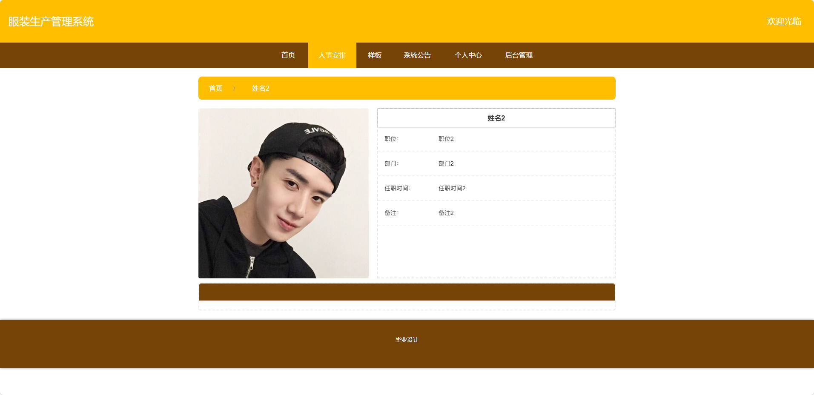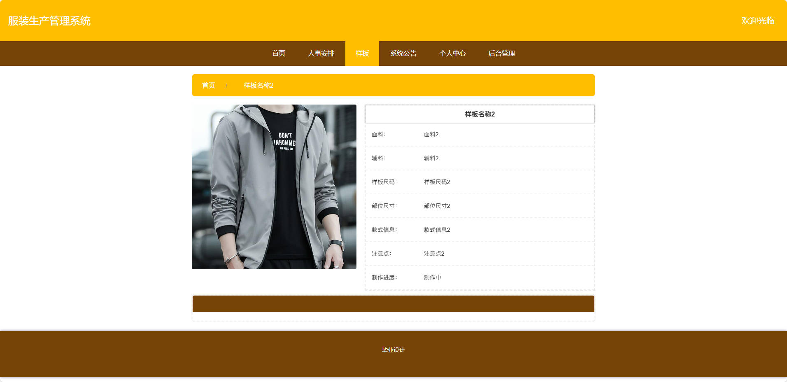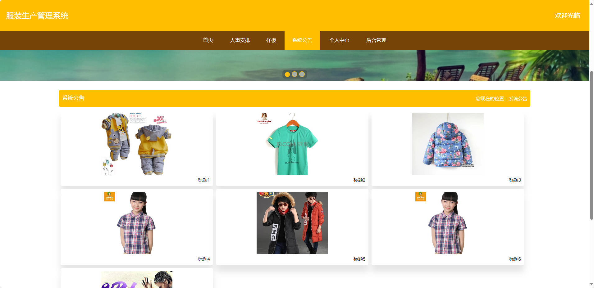

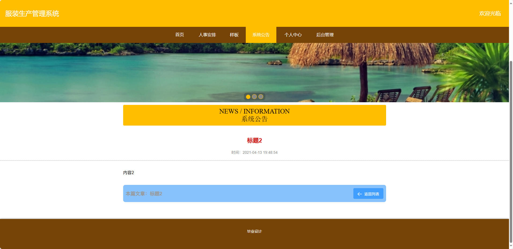

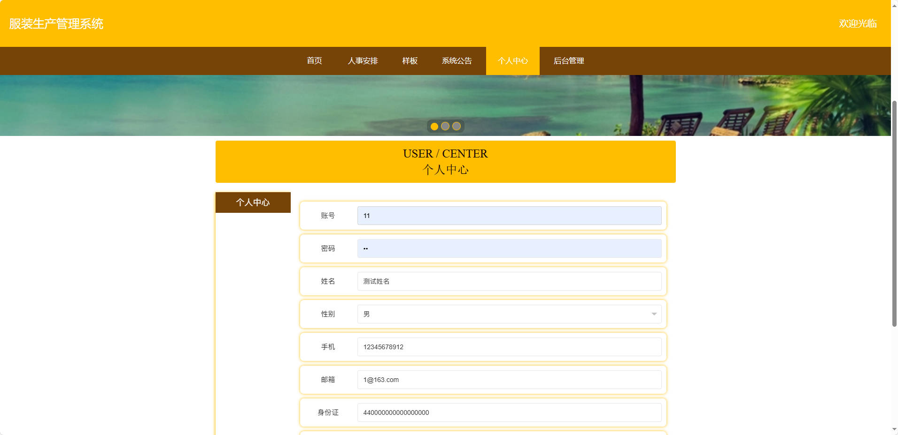

### 后台

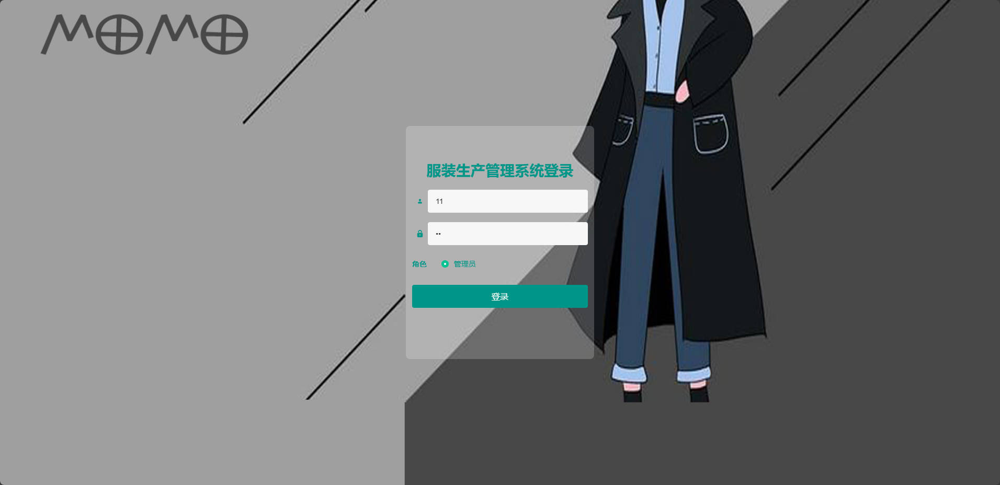

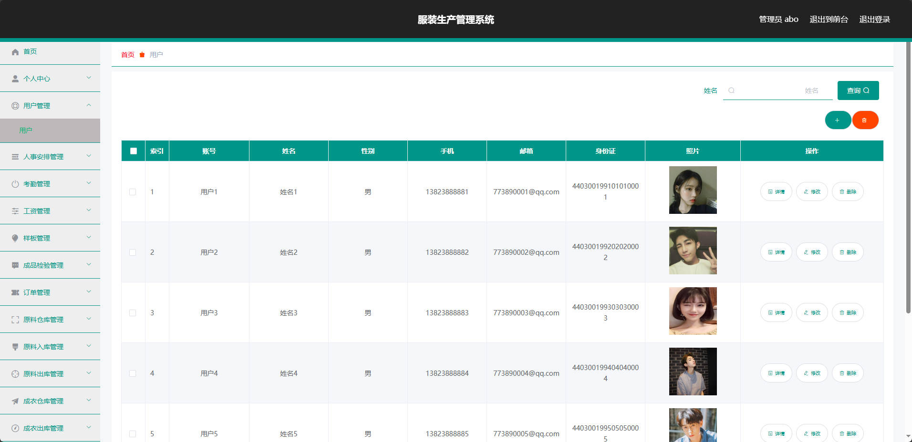

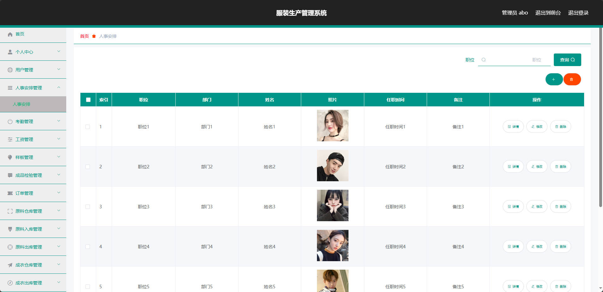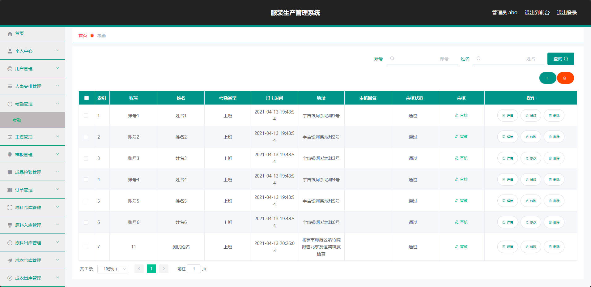

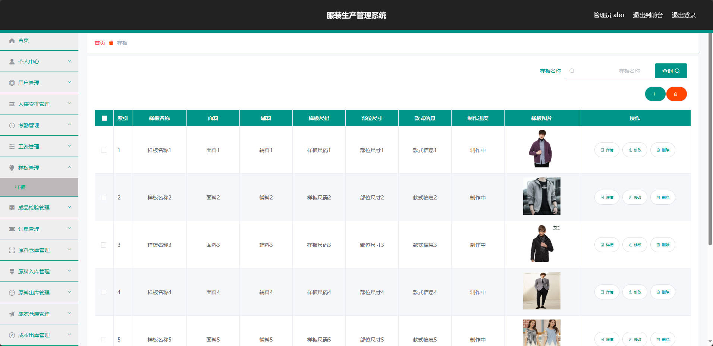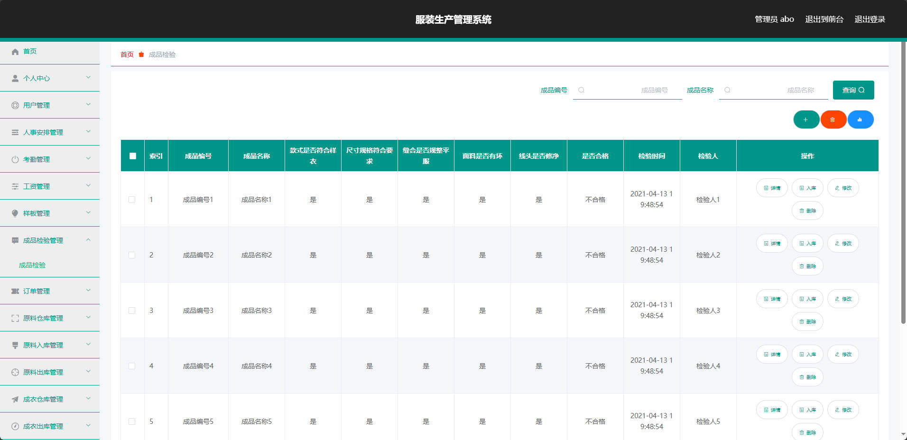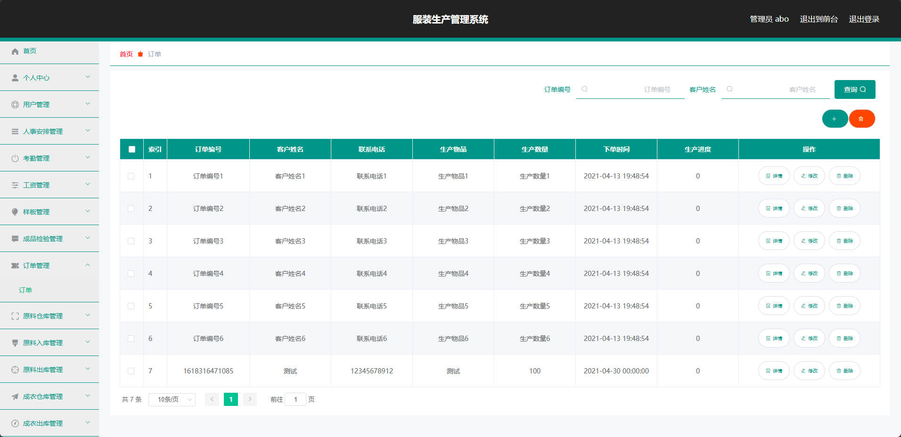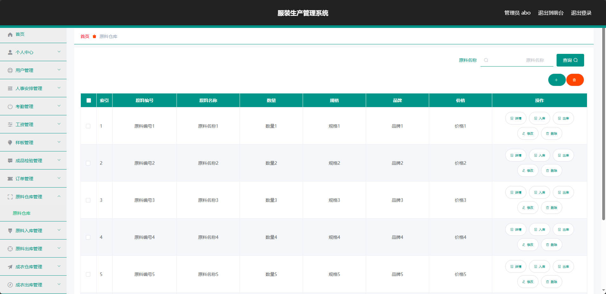

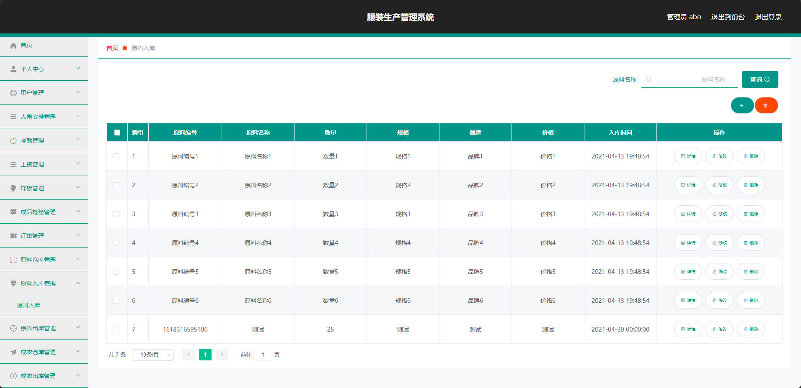

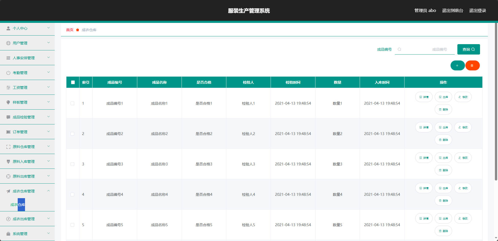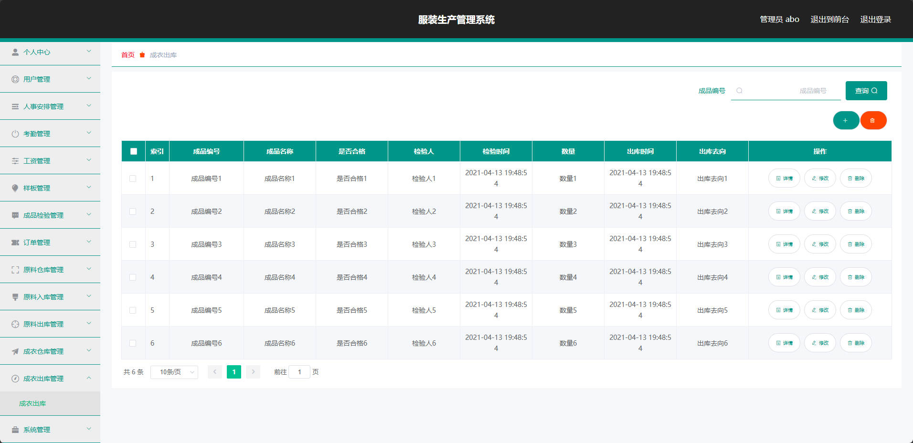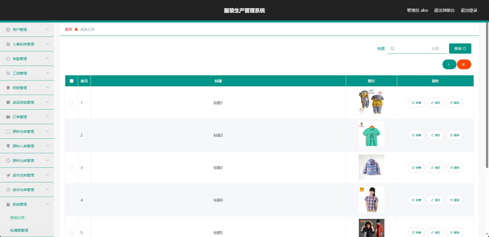

## 访问路径

### 前台

```properties
http://localhost:8080/springbootww862/front/pages/login/login.html

账号 11
密码 11
```

### 后台

```properties
http://localhost:8080/springbootww862/admin/dist/index.html#/login

账号 abo
密码 abo
```


## 功能图

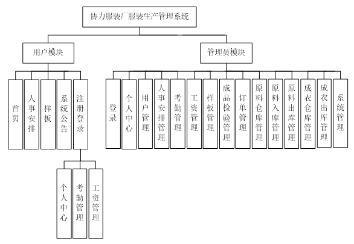


## 文档目录

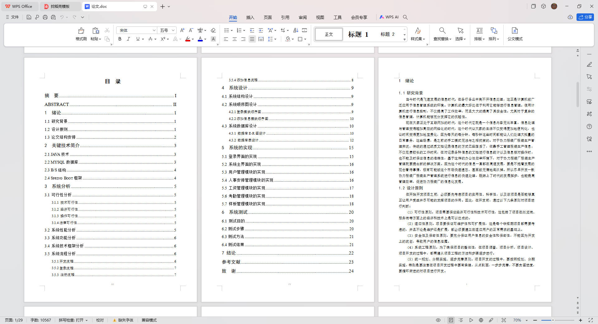


## 打赏或交流


